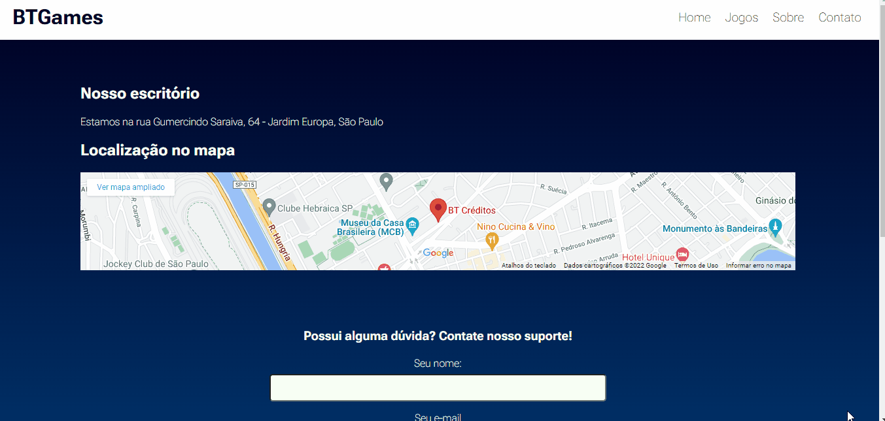

<h1 style="text-align:center">BTGames</h1>

BTGames é uma empresa de aluguel de jogos digitais que busca sempre trazer a diversão para a vida da pessoas.

<h2>Aplicação</h2>

Site estático que possui 4 páginas: Home, Jogos, Sobre e Contato. O usuário pode trocar de página a vontade por meio do menu de navegação presente na parte superior direita da página

Home: Página inicial do site, nela é mostrado pequenos textos sobre o funcionamento da empresa com imagens referentes ao assunto.

 

 

Jogos: Página com fileiras de Cards que representam um jogo, contendo título, descrição e ano de lançameno do jogo. O usuário pode visualizar as fileiras e os jogos disponíveis.

 

 

Sobre: Página que contém informações refente à empresa. Nela estão as sessões Quem Somos, que diz quem é a BTGames, Nossa Missão, que diz qual a missão da empresa, e Nossos Valores, que cita os valores presenta na empresa.

 

 

Contato: Página com informações de localização e suporte da página. Primeiramente, possui o endereço de nosso escritório e um mapa do google maps. Após isso, está presente um formulário caso o usuário queira mandar uma mensagem para o suporte da empresa.

 

 

Responsividade: o site se adequa para os diversos tamanhos de dispositivos diferentes, focando em desktop, tablet e celular.

 

 

<h2>Requisitos</h2>

<ul>
    <li>Responsividade</li>
    <li>Versionamento de código (Git)</li>
    <li>Documentação (readme)</li>
    <li>Desafio: usar CSS animation</li>
    <li>Mínimo de 3 páginas</li>
</ul>

<h2>Como instalar o projeto</h2>
<ol>
    <li>git clone</li>
    <li>abra a pasta do projeto</li>
    <li>abra index.html no navegador</li>
</ol>

<h2>Tecnologias</h2>
<ul>
    <li>HTML5</li>
    <li>CSS3</li>
    <li>JAVASCRIPT</li>
    <li>GIT</li>
<qul>